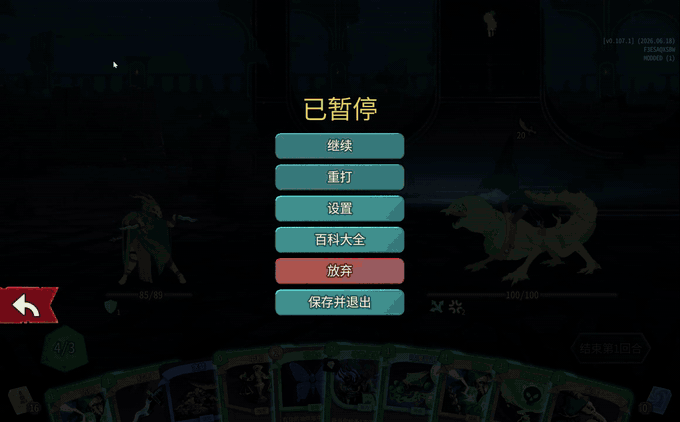
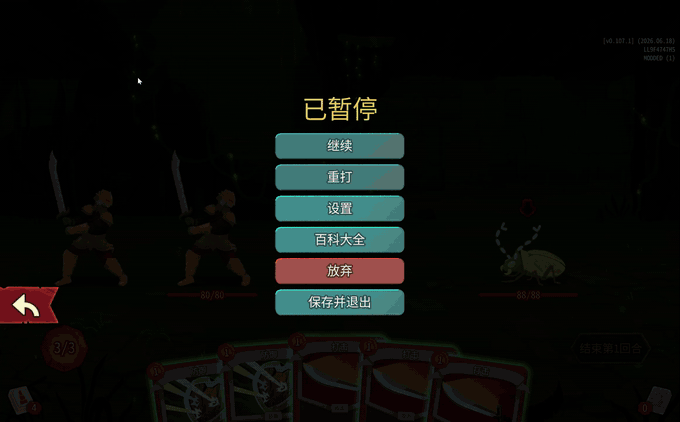
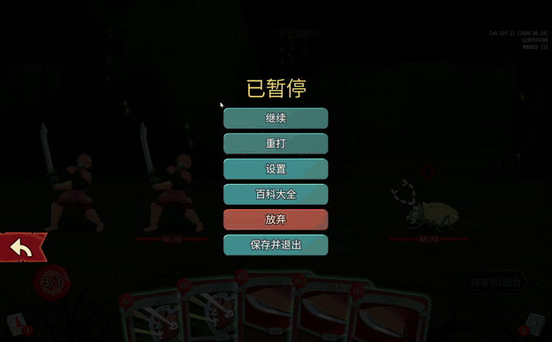
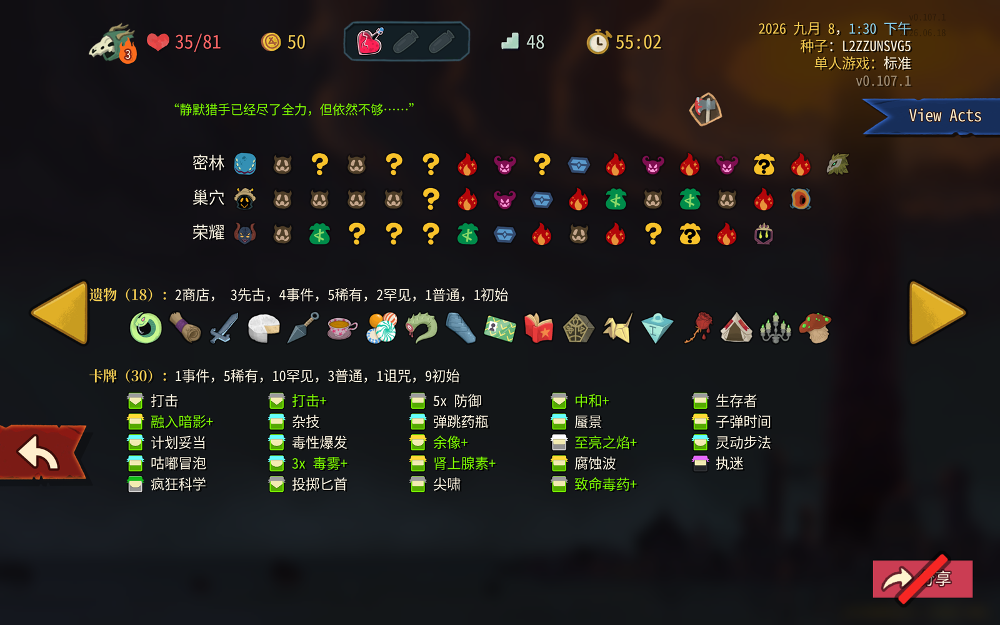
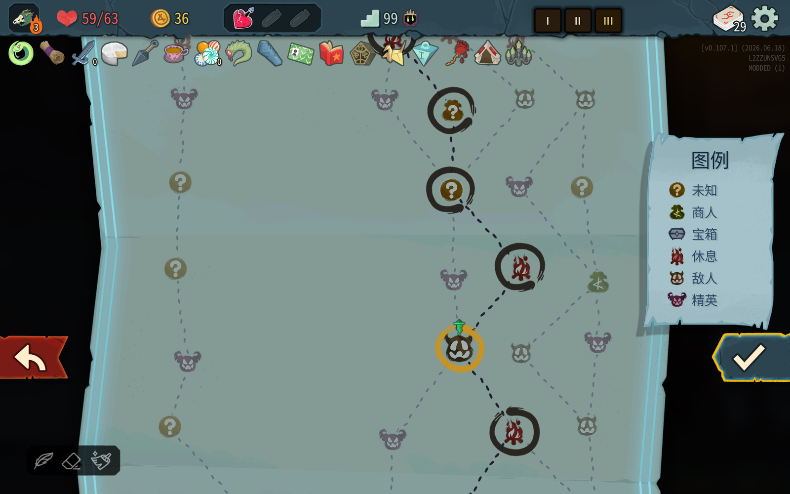

# Retry the Spire

Retry the current room or resume a *Slay the Spire 2* run from any visited map node—solo or multiplayer.

**[Steam Workshop](https://steamcommunity.com/sharedfiles/filedetails/?id=3813193061)** · **[Latest release](https://github.com/666666lyc/retry-the-spire/releases/latest)** · **[Installation guide](INSTALL.md)**

Current release: **v0.5.3**

[English](#english) | [简体中文](#简体中文)

> [!IMPORTANT]
> Retry the Spire is a modified fork of [sts2mods/Retry](https://github.com/sts2mods/Retry). Do not enable both mods at the same time: they patch the same screens and run-loading paths.

## English

Retry the Spire gives you two ways to try again without starting an entire run over:

- **Retry the current room** from the pause menu.
- **Resume a past run** from a visited node in Run History, with the recorded run state restored.

### Current-room retry

#### Single-player

The **Retry** button reloads the native save captured when you entered the room.



#### Multiplayer — everyone has the mod

When every connected player uses v0.5.0 or newer, all players reload in place while keeping the current network connection.



#### Multiplayer — an unmodded player is present

The host falls back to the game's native replacement lobby. Updated peers find and ready in that lobby automatically; unmodded players can rejoin manually without installing a dependency.



### Resume from Run History

1. Open a run in **Run History** and select **View Acts**.
2. Switch to the act you want, select a visited node, and confirm.
3. Retry the run with its recorded seed, inventory, player state, and map progress.





### What is restored

- Seed, character, ascension, deck, relics, potions, HP, gold, and play time.
- Visited map path, current act and node, event history, and room queues.
- Versioned room-entry player, map, and RNG snapshots when available.
- Original multiplayer participants under their recorded Steam IDs.
- Separate single-player and multiplayer save slots.
- Unmodified Standard history retries remain eligible to unlock the next ascension level in both single-player and multiplayer.

Snapshots are stored beside the active profile saves, allowing Steam Cloud to carry exact retries across devices.

### Multiplayer behavior

| Scenario | Required installs | Result |
| --- | --- | --- |
| Current-room retry, all peers on v0.5.0+ | Every connected player | The room reloads without leaving the current connection. |
| Current-room retry with an unmodded peer | Host only | A native replacement lobby opens; updated peers reconnect automatically and unmodded players rejoin manually. |
| Resume a multiplayer history entry | Host only | The run is rebuilt as a native `SerializableRun` and opened in the standard load-run lobby. |

Gameplay or content mods that register game models must still match on every multiplayer client. Cosmetic or non-gameplay mods may differ.

### Installation

#### Steam Workshop

1. [Subscribe on Steam Workshop](https://steamcommunity.com/sharedfiles/filedetails/?id=3813193061).
2. Launch the game and enable **Retry the Spire** from the Mods screen.
3. Disable or remove the original **Retry** mod.

#### Manual

Download the archive from [GitHub Releases](https://github.com/666666lyc/retry-the-spire/releases/latest) and extract it so the final layout is:

```text
mods/
  RetryTheSpire/
    RetryTheSpire.dll
    mod_manifest.json
    LICENSE
    INSTALL.md
```

### Limitations

- Historical runs created before v0.5.1 use best-effort reconstruction when a room snapshot is unavailable; combat-only counters and RNG may diverge.
- Retry the Spire v0.4.x uses an incompatible multiplayer protocol. Upgrade it to v0.5.0 or newer, or disable it before joining a current room.
- The original Retry and Retry the Spire are mutually exclusive at runtime.
- The game disables achievements while mods are loaded.

### Building

The project requires the .NET 9 SDK and a local copy of *Slay the Spire 2*.

```bash
./build.sh Release
```

The project references game assemblies from the local installation but does not redistribute them.

### Attribution and license

Retry the Spire is maintained by **666666lyc** and is derived from [Retry](https://github.com/sts2mods/Retry), originally created by Austin/sts2mods.

The original MIT license and copyright notice are preserved in [`LICENSE`](LICENSE). Additional attribution for this fork is recorded in [`NOTICE`](NOTICE). The modifications are distributed under the same MIT license.

---

## 简体中文

Retry the Spire 提供两种重打方式，不必为了再试一次而放弃整局：

- 在暂停菜单中**重打当前房间**。
- 从对局历史中选择已经到访的节点，**恢复过去的对局**。

### 当前房间重打

#### 单人模式

暂停后点击**重打**，即可读取进入当前房间时生成的原生存档。


#### 多人模式——全员安装模组

当所有在线玩家均使用 v0.5.0 或更高版本时，全员会保留当前网络连接并直接重载当前房间。


#### 多人模式——存在未安装模组的玩家

房主会自动改用游戏原生的替换大厅。新版模组玩家会自动找到大厅并准备；未安装模组的玩家无需额外依赖，可以手动重新加入。


### 从对局历史重打

1. 在**对局历史**中打开一局记录，点击 **View Acts（查看章节）**。
2. 切换到需要重打的章节，选择已经到访的节点并确认。
3. 使用记录中的种子、角色状态、物品与地图进度重新开始。


### 恢复内容

- 种子、角色、进阶等级、牌组、遗物、药水、生命值、金币与游戏时间。
- 已访问路线、当前章节和节点、事件历史与房间队列。
- 可用的版本化房间入口玩家状态、地图和随机数快照。
- 原多人对局的参与者及其 Steam ID。
- 相互独立的单人和多人存档槽。
- 未修改的标准模式历史重打在单人和多人模式中均可正常解锁下一进阶等级。

快照与当前档案的存档放在一起，因此 Steam 云可以将精确重打数据同步到其他设备。

### 多人模式说明

| 场景 | 安装要求 | 结果 |
| --- | --- | --- |
| 当前房间重打，全员使用 v0.5.0+ | 所有在线玩家 | 不离开当前连接，所有玩家直接重载。 |
| 当前房间重打，存在未安装玩家 | 仅房主必须安装 | 创建原生替换大厅；新版玩家自动重连，未安装玩家手动重进。 |
| 恢复多人历史对局 | 仅房主必须安装 | 将记录重建为原生 `SerializableRun`，并打开标准读取对局大厅。 |

注册游戏模型的玩法或内容模组仍需在所有多人客户端上保持一致；外观类或不影响玩法的模组可以不同。

### 安装

#### Steam 创意工坊

1. 在 [Steam 创意工坊](https://steamcommunity.com/sharedfiles/filedetails/?id=3813193061)订阅本模组。
2. 启动游戏，在模组界面中启用 **Retry the Spire**。
3. 禁用或移除原版 **Retry** 模组。

#### 手动安装

从 [GitHub Releases](https://github.com/666666lyc/retry-the-spire/releases/latest) 下载压缩包并解压，最终目录结构应为：

```text
mods/
  RetryTheSpire/
    RetryTheSpire.dll
    mod_manifest.json
    LICENSE
    INSTALL.md
```

### 已知限制

- v0.5.1 之前生成的历史对局若缺少房间快照，会使用尽力重建；无法准确还原的战斗内计数及随机结果可能与原对局不同。
- Retry the Spire v0.4.x 使用不兼容的多人通信协议。加入当前版本房间前，请升级到 v0.5.0 或更高版本，或禁用旧版。
- 原版 Retry 与 Retry the Spire 无法同时运行。
- 游戏会在加载模组时禁用成就。

### 构建

本项目需要 .NET 9 SDK，以及本地安装的《杀戮尖塔 2》。

```bash
./build.sh Release
```

本项目会引用本地游戏安装目录中的程序集，但不会重新分发这些文件。

### 署名与许可证

Retry the Spire 由 **666666lyc** 维护，派生自 Austin/sts2mods 最初创建的 [Retry](https://github.com/sts2mods/Retry)。

原 MIT 许可证与版权声明完整保留在 [`LICENSE`](LICENSE) 中。此分支的额外署名记录在 [`NOTICE`](NOTICE) 中。所有修改均使用相同的 MIT 许可证发布。
